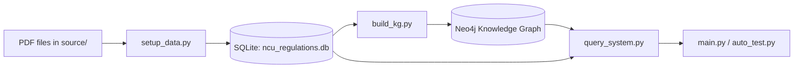
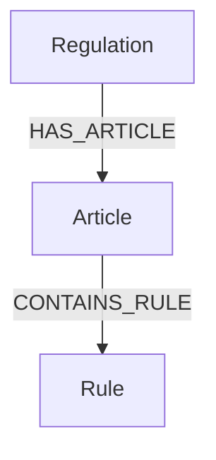

# Homework 4

Assignment 4 is a knowledge-graph-based question answering system for NCU regulations. The goal is not to build a generic chatbot, but to build a pipeline that can:

1. Parse regulation PDFs into structured data.
2. Build a usable knowledge graph from the structured data.
3. Retrieve the correct regulation evidence for a question.
4. Generate a short answer grounded in the retrieved evidence.

This README serves as both a project guide and a report draft. Sections that require manual screenshots or your own experimental numbers are intentionally left blank for you to fill in.

---

## 🚀 Quick Start

### Prerequisites

- [uv](https://docs.astral.sh/uv/) : make sure it is installed.
- Python 3.11
- Docker Desktop

### 1. Clone the repository

```bash
git clone https://github.com/wangwenho/ce8014-agentic-ai-2026.git
cd hw4
```

### 2. Start Neo4j

```bash
docker run -d --name neo4j -p 7474:7474 -p 7687:7687 -e NEO4J_AUTH=neo4j/password neo4j:latest
```

### 3. Install dependencies

```bash
uv sync
```

If you prefer `pip`, you can also install from `requirements.txt`.

### 4. Build the database and knowledge graph

```bash
uv run python setup_data.py
uv run python build_kg.py
```

### 5. Run the query system

```bash
uv run python main.py
```

### 6. Run the automatic evaluation

```bash
uv run python auto_test.py
```

> [!NOTE]
>
> - If `ncu_regulations.db` already exists and is up to date, you can skip `setup_data.py`.
> - Always run commands inside the `hw4` directory so relative paths resolve correctly.

---

## 📌 Project Purpose

This assignment focuses on retrieval quality and grounding quality.

- Retrieval quality means the system should find the right article or rule quickly.
- Grounding quality means the final answer should stay close to the retrieved regulation text instead of hallucinating.

The system therefore uses a structured pipeline instead of sending all regulations to a model at once.

---

## 🧠 What I Modified

The provided template was turned into a complete working KG-QA pipeline.

- `setup_data.py`
  - Parses PDFs under `source/`.
  - Stores regulation metadata and article text into SQLite.

- `build_kg.py`
  - Reads `ncu_regulations.db`.
  - Builds Neo4j nodes and relationships.
  - Splits article text into rule-level facts.
  - Creates the required fulltext indexes.

- `query_system.py`
  - Converts a question into a retrieval intent.
  - Uses typed and broad Neo4j retrieval.
  - Falls back to SQLite when KG recall is weak.
  - Generates short, evidence-grounded answers.
  - Returns deterministic PASS/FAIL for the judge prompt in `auto_test.py`.

- `main.py`
  - Redirects the entry point to the query system.

- `llm_loader.py`
  - Loads the local Hugging Face model used by the project.

The final result is a complete workflow that can be built, queried, and evaluated end to end.

---

## 🛠 Technologies and Packages

### Core technologies

- Python 3.11
- SQLite
- Neo4j
- Local Hugging Face inference
- Knowledge graph retrieval

### Main packages

| Package | Purpose |
|---|---|
| `pdfplumber` | Parse PDF regulation files |
| `neo4j` | Connect to and write the knowledge graph |
| `python-dotenv` | Load environment variables |
| `transformers` | Load the local Hugging Face model |
| `torch` | Model inference backend |
| `accelerate` | Support device placement for model loading |
| `sentencepiece` | Tokenizer support for some models |
| `langchain` | Compatibility with the provided local LLM pipeline |
| `langchain-core` | Core interfaces used by the LLM pipeline |
| `langchain-huggingface` | Hugging Face integration |

### Model setting

- Default local model: `Qwen/Qwen2.5-3B-Instruct`
- Only smaller local models are allowed if you want to change it.
- External API-based models are not allowed in this assignment.

---

## 🏗 System Architecture

The project follows a simple but effective three-layer design:

1. PDF to SQLite
2. SQLite to Neo4j knowledge graph
3. Neo4j retrieval to grounded answer generation

### Data flow



### KG schema



### Required contract

- Graph schema: `(:Regulation)-[:HAS_ARTICLE]->(:Article)-[:CONTAINS_RULE]->(:Rule)`
- Article properties: `number`, `content`, `reg_name`, `category`
- Rule properties: `rule_id`, `type`, `action`, `result`, `art_ref`, `reg_name`
- Fulltext indexes: `article_content_idx`, `rule_idx`
- SQLite file: `ncu_regulations.db`

> [!IMPORTANT]
>
> These names are part of the assignment contract. Renaming them may break retrieval or auto evaluation.

---

## 🔍 Module-by-Module Explanation

### `setup_data.py`

This file is the ETL layer.

It reads the regulation PDFs in `source/`, extracts article text with `pdfplumber`, cleans the text, and writes the result into two SQLite tables:

- `regulations`: stores regulation name and category
- `articles`: stores article number and content

The output database is `ncu_regulations.db`.

### `build_kg.py`

This file turns the SQLite data into a knowledge graph.

Its job is to:

- Create one `Regulation` node per regulation.
- Create one `Article` node per article.
- Split article text into smaller rule-like clauses.
- Create `Rule` nodes for those clauses.
- Connect the graph with `HAS_ARTICLE` and `CONTAINS_RULE`.
- Build fulltext indexes for retrieval.

The article splitting matters because many questions ask for a specific sentence-level rule, not just the whole article.

### `query_system.py`

This is the core question answering module.

It does four things:

1. Classify the question into a rough type.
2. Build a retrieval query for Neo4j.
3. Fall back to SQLite if Neo4j retrieval is sparse.
4. Produce a short answer from the retrieved evidence.

The answer generation is intentionally conservative. It prefers direct facts such as:

- `20 minutes.`
- `No.`
- `3 working days.`
- `60 points.`

This keeps the system aligned with the evaluation style used by `auto_test.py`.

### `llm_loader.py`

This file loads the local Hugging Face model used by the project.

It keeps the model on local cache and avoids external API dependencies. The default model is `Qwen/Qwen2.5-3B-Instruct`, which fits the assignment requirement to stay local and avoid larger models.

### `auto_test.py`

This file reads `test_data.json`, queries the system, and evaluates the response using an LLM-as-a-judge prompt.

In this project, the judge prompt is handled deterministically when possible so evaluation can complete reliably even without loading a large remote service.

### `main.py`

This file is only the executable entry point. It redirects execution to `query_system.main()`.

---

## 🧩 Query and Retrieval Logic

The retrieval strategy is designed to balance precision and recall.

### Step 1: Question understanding

The system first maps the user question to a rough category, such as:

- exam timing
- student ID replacement
- graduation credits
- physical education requirements
- passing score
- leave of absence

### Step 2: Typed retrieval

The system creates keyword hints from the question category and uses Neo4j fulltext search on the article and rule indexes.

### Step 3: Broad retrieval

If typed retrieval is too narrow, the system also performs a broader search using the full question keywords.

### Step 4: SQLite fallback

If Neo4j retrieval is empty or weak, the system falls back to the SQLite article table and retrieves likely matching article snippets.

### Step 5: Answer synthesis

The answer generator then uses the best evidence to return a short grounded response instead of a long explanation.

---

## 📊 Experimental Results

### 1. Knowledge Graph Screenshot

Open Neo4j Browser at <http://localhost:7474> (password: password) and run the following query to visualize the graph:

```text
MATCH p=(r:Regulation)-[:HAS_ARTICLE]->(a:Article)-[:CONTAINS_RULE]->(u:Rule)
RETURN p
LIMIT 50
```


```
MATCH p=(a:Article {number: "Article 13"})-[:CONTAINS_RULE]->(u:Rule)
RETURN p
LIMIT 20
```


### 3. Auto Test Result

run `uv run python auto_test.py` to see the evaluation summary:

```text
=== Evaluation Summary (No Metadata) ===
Total: 20
Passed: 20
Failed: 0
Accuracy: 100.0%
==============================
```

---

## 🧪 Testing

Run the automated evaluation with:

```bash
uv run python auto_test.py
```

If you want to validate the graph build step separately:

```bash
uv run python build_kg.py
```

If you want to test the query flow manually:

```bash
uv run python main.py
```
